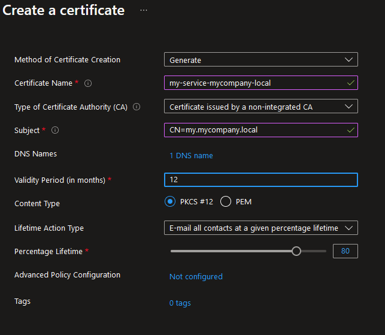

# Offline Certificate Authority

This repository demonstrates how to setup an offline Certificate Authority for an internal domain.
It is used to sign certificates for your local domain names, used in a private network within, for example, in Azure.

A reason for having this is could be that an application gateway can be made to trust internal services by adding the root certificate to the trusted root store of the application gateway.
This is similar to what is described in [this article](https://learn.microsoft.com/en-us/azure/application-gateway/self-signed-certificates). However, we want to have the certificates managed in Azure Key Vault.
This enables services that use internal certificates, like API Management to automatically reload renewed certificates without down time.

## Setup

Please make sure these tools are installed:

- [Step CLI](https://smallstep.com/docs/step-cli/installation/) - This is used to manage the CA and issue certificates.  
  Setup by running `winget install Smallstep.step`
- [Azure CLI](https://docs.microsoft.com/en-us/cli/azure/install-azure-cli) - used to manage the certificates into Azure Key Vault
- [Powershell 7+](https://docs.microsoft.com/en-us/powershell/scripting/install/installing-powershell?view=powershell-7.1) - used to run the scripts in this repository

Note that you'll need to restart your shell after installing these tools to update the path variable. If you have Chocolatey installed, you can run `refreshenv` to update the path variable.

You'll also need to login to Azure CLI and have a Key Vault ready to store the certificates in.

## Setup an offline CA

This CA was initialized by running the following command:

```powershell
$ENV:STEPPATH="$PWD/ca"
mkdir $PWD/ca
step ca init --deployment-type standalone --name MyLocalDomain --dns mycompany.local --address 127.0.0.1:443 --provisioner MyCompany 
```

This generates a root and intermediate certificate under `ca/certs`. The keys are under `ca/secrets`.
The CA certs are valid for 10 years.

If you follow these steps to create a new CA, make sure you keep the generated passwords safe! You'll need them to prepare the CA certificates to Azure later.

The secrets generated for this CA must *not* be checked in to source control. Once the certificates have been pushed to Key Vault, the secrets should be deleted and passwords are no longer needed.

## Upload CA certificates to Azure Key Vault

For use in Azure, we need to create PFX files from the certificates. The .pfx files must *not* have encrypted keys. Azure CLI cannot import encrypted keys into Key Vault.

```powershell
step certificate p12 --no-password --insecure root_ca.pfx .\ca\certs\root_ca.crt .\ca\secrets\root_ca_key
step certificate p12 --no-password --insecure intermediate_ca.pfx .\ca\certs\intermediate_ca.crt .\ca\secrets\intermediate_ca_key
```

Next, import the certificates into Key Vault.

```powershell
az keyvault certificate import --vault-name my-kv-name  -n mycompany-local-intermediate -f .\.\ca\certs\intermediate_ca.pfx 
az keyvault certificate import --vault-name my-kv-name  -n mycompany-local-root -f .\ca\certs\root_ca.pfx
```

You're now ready to issue certificates for the `mycompany.local` domain from your Key Vault.

## Managing Certificates using the offline CA

With the CA certs stored in KeyVault, we can start requesting certificates and signing them.

### Issue a certificate from Key Vault

To issue a certificate, start by creating a new certificate request in Azure Key Vault. Make sure you specify you want to use a *non-integrated CA*.



Now use the `SignCSR.ps1` script to sign the CSR. This script will download the CSR from Key Vault, sign it using the CA certificates and upload the signed certificate back to Key Vault.

```powershell
.\SignCSR.ps1 -keyVaultName my-kv-name -certificateName mycompany-local-portal -intermediateName  mycompany-local-intermediate
```

### Renew a Key Vayult certificate

To renew a certificate, find the certificate in the Key Vault in Azure Portal, select it and on the version overview click the *New Version* button. This will set the certificate to *Pending* status. You can now use the `SignCSR.ps1` script to sign the CSR again.

### Generate a certificate without a CSR

Using the CA certificates, we can generate a wildcard certificate for the `mycompany.local` domain. Note that the output is a bundle of the certificate and the intermediate certificate.

```powershell
$ENV:STEPPATH="$PWD/ca"
step certificate create *.mycompany.local wildcard.crt wildcard.key `
    --profile leaf --not-after=8760h `
    --ca ./ca/certs/intermediate_ca.crt --ca-key ./ca/secrets/intermediate_ca_key --bundle
```

To make the certificate chain complete, we need to add the root certificate to the bundle:

```powershell
cat ./ca/certs/root_ca.crt >> wildcard.crt
```

### Verify certificates

```powershell
step certificate verify .\wildcard.crt --roots ".\ca\certs\root_ca.crt,.\ca\certs\intermediate_ca.crt"
step certificate verify https://apim-dev.mycompany.local/some-api/api/some-endpoint --roots ".\ca\certs\root_ca.crt,.\ca\certs\intermediate_ca.crt"
```

## References
- [Step : Basic Operations](https://smallstep.com/docs/step-cli/basic-crypto-operations/)
- [Create and merge a certificate signing request in Key Vault](https://learn.microsoft.com/en-us/azure/key-vault/certificates/create-certificate-signing-request?tabs=azure-powershell#add-more-information-to-the-csr)
- [Application Gateway : Generate an Azure Application Gateway self-signed certificate with a custom root CA](https://learn.microsoft.com/en-us/azure/application-gateway/self-signed-certificates)